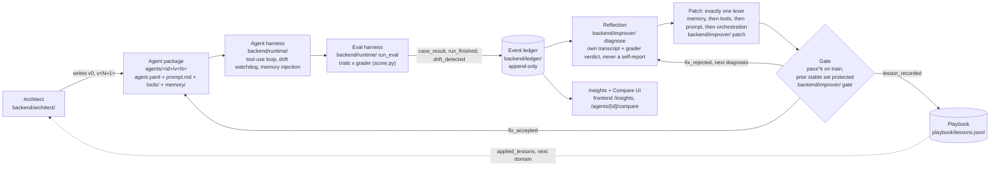

# Task Orchestrator

Given a **goal**, a set of **tools**, and a **grader**, Task Orchestrator generates a
specialized agent, runs it against the eval suite with every task repeated so pass
rates carry error bars, and reflects on its own graded failures — using its
harness-recorded transcripts and the third-party tool data it actually saw — to
propose memory, tool and prompt changes. Every proposed change is gated on `pass^k`
before it ships, and the outputs of the improved agent are shown side by side with
v0 so the improvement is visible, not just a number on a chart.

> Built for Syndicate by Maximor, Track 1 (Automated Agent Engineering), with
> [AO](https://github.com/Untrivial-ai/agent-orchestrator) orchestrating one worker
> session per workstream. See **[How AO was used](#how-ao-was-used)** below and
> `BUILD_LOG.md` for the full session ledger.
>
> **Status as of this writing:** contracts, the ledger, the agent runtime + eval
> harness, the architect, both evaluators and the frontend shell are merged to
> `main` (`BUILD_LOG.md`, Phase 0–1). The improver (`backend/improver/` —
> reflection, patch, gate), issues wiring, the playbook, the real Insights charts
> and `scripts/demo_run.py` are Phase 2–3 and land next; this README describes the
> whole system per the frozen contracts and will be updated as each piece merges.
> The **[Results](#results)** section below is an explicit placeholder until then.

## Architecture



Two agents are generated against this system: **`github_triage`** (Domain A — a
real third-party API, GitHub's REST API against
[`Untrivial-ai/agent-orchestrator`](https://github.com/Untrivial-ai/agent-orchestrator))
and **`ticket_triage`** (Domain B — synthetic support tickets, no external API, the
target of the playbook ablation). See `evaluators/github_triage/README.md` and
`evaluators/ticket_triage/README.md`.

## The four-step loop

| step | module | what it does |
|---|---|---|
| **1. Generate** | `backend/architect/` (`generate.py`) | one STRONG-model call per step: reads the evaluator README + sample train tasks, picks an orchestration mode, drafts `prompt.md`, selects/writes tools, optionally applies `playbook/lessons.jsonl`. Writes `agents/<id>/v0/`, emits `agent_created`. |
| **2. Run** | `backend/runtime/` (loop, `drift.py`, `run_eval`) | loads a package version, runs the tool-use loop for each task `EVAL_TRIALS` times, injects memory before each task, and lets the drift watchdog nudge or abort a run that loops, blows its token budget, or wanders off-task. Emits one `case_result` per (task, trial) and one `run_finished`. |
| **3. Analyze** | `backend/improver/` (`diagnose`) | reflection first: for each failure group, the agent reasons over its own **harness-recorded transcript**, the tool data it saw, and the grader's verdict — never asked whether it succeeded — and proposes memory/tool/prompt changes with evidence task ids. Emits `fix_proposed`. |
| **4. Improve** | `backend/improver/` (`patch`, `gate`) | applies exactly one lever, writes `agents/<id>/v<N+1>/` as a full immutable snapshot plus `CHANGES.diff`, then re-runs train at `EVAL_TRIALS`. Accepts iff the prior stable-pass set survives and `pass@1` does not drop; on accept, runs holdout once and records it; on reject, tries the next diagnosis. Emits `fix_accepted` / `fix_rejected`. |

Every outcome above is one row in the append-only `events` table
(`contracts/events.py`); every chart in the UI is a pure read over that table
(`backend/ledger/metrics.py`) — nothing on screen is a number someone typed in.

## Judges' questions, answered

A Maximor judge posted the four questions Track 1 judges actually ask
(`PLAN_ADDENDUM.md` §Why). Here is where to see each answered live:

**1. How does the agent get better over time?**
`/insights` → **Pass rate by version**: `pass@1` and `pass^k` as two bands (mean ±
std, min/max whiskers) across every accepted version, train and holdout, annotated
with `issue_opened` / `fix_accepted` / `fix_rejected` / drift markers. The **Fixes**
tab on `/agents/[id]` shows the same climb as a timeline of individual mechanisms
rather than one curve.

**2. Can you show the agent's outputs getting better through its own self-reflection
and memory growing?**
`/agents/[id]/compare?case_id=` shows the **same task** at v0 and at the current
version, side by side — output, the memory entries injected in each version, and
the tool-call count. The **Memory** tab shows `rules.jsonl` / `tool_notes.jsonl`
growing (and self-correcting: a rule with more misses than hits after 4+ uses is
demoted, kept on disk, and no longer injected — `memory_demoted`). `/insights` →
**Memory growth** plots rule/tool-note count and mean confidence per version, with
demotions marked. Every entry the agent proposes traces back to the reflection step
reasoning over its own transcript, never a self-report (`PLAN_ADDENDUM.md` §0/§E).

**3. Can it learn complex contextual logic from third-party tool data and apply it
in later runs?**
`github_triage`'s tools (`backend/toolbox/github.py`) are a real, cached GitHub REST
client. The contextual logic worth learning — what each label means in this repo,
file-path → component mapping, Windows/ConPTY reports, who owns what — lives in
`memory/rules.jsonl` and `memory/tool_notes.jsonl`, written by reflection over that
tool data. The evaluator uses a **temporal split**: train is the oldest 70% of
tasks, holdout is the newest 30%. The agent's memory is built entirely from train;
holdout tasks were filed after everything it knows, so a correct holdout answer is
literally "applying that context in later runs," not memorization
(`evaluators/github_triage/README.md`).

**4. Does it balance cost-effectiveness and speed?**
`/insights` → **Cost, latency and pass@1-vs-cost** (cost per run and p50/p95
latency by version, plus a scatter so accuracy and cost movement are visible
together) and **Tool-usage efficiency** (tool calls, tool errors, redundant calls,
tool-response tokens, and latency per task — all expected to fall as fixes land).
A `tools`-lever fix card carries a `metric_signal` naming the exact heuristic that
drove it (e.g. "12 redundant `github_search_similar_issues` calls per task").

## Eval rigor, in the judges' vocabulary

Following Anthropic's "Demystifying evals for AI agents" and "Writing effective
tools for agents" (linked by the judge), the whole codebase uses this vocabulary
consistently — code, ledger, UI and this README:

- **task** — one evaluator case (`cases.jsonl` row). **trial** — one repeated
  attempt at a task (`EVAL_TRIALS`, default 3). **grader** — `score.py`.
  **transcript** — the harness's own record of what happened, never the agent's
  account of itself. **eval harness** — `run_eval`. **agent harness** — the
  tool-use loop. **eval suite** — one `evaluators/<id>/` directory.
- **pass@1** vs **pass^k**: `pass@1` is the mean per-trial pass rate over tasks;
  `pass^k` (k = trials) is the fraction of tasks that passed **every** trial —
  those are the **stable pass set**. The gate accepts a candidate on `pass^k`,
  not `pass@1`, because a lucky single trial should never let a fix through: a
  task that flips 2 of 3 trials is not "improved," it's flaky, and the gate must
  not reward flakiness.
- **capability suite** (the train set — expected to start low and climb) vs
  **regression suite** (the stable-pass tasks plus every issue-derived task —
  expected to sit near 100%; a drop there is a regression, full stop).
- **graduation**: a task that becomes stably passing emits `task_graduated`;
  Insights tracks the running count.
- **trial isolation**: each trial starts from a clean transcript and never sees
  another trial's output or the improver's diagnoses (`contracts/transcript.md`).
- **grade outcomes, not paths**: the grader reads the final output only — tool
  calls, tool errors, tokens, latency and drift are tracked metrics, never fed
  into `passed`/`score`.
- **"Grader disagreed?"**: any failed trial can be flagged from the UI, which
  files an issue tagged `grader-bug`; a resulting fix uses `lever = grader` and is
  excluded from the agent's own improvement curve — it fixes the measuring stick,
  not the agent.
- **saturation**: if train `pass@1` reaches ≥95% for two consecutive versions,
  Insights shows "capability suite saturated — add harder tasks" rather than
  quietly reporting a hollow ceiling.

One sentence on the package shape: an agent here is the [Managed Agents]-style
`model + system prompt + tools + MCP servers + skills`, with `agents/<id>/v<N>/memory/`
(`rules.jsonl`, `tool_notes.jsonl`, `episodes.jsonl`) playing the role skills play
in that shape — a versioned, inspectable, self-correcting body of learned behavior
that sits alongside the prompt rather than being baked into it.

[Managed Agents]: https://platform.claude.com/docs/en/managed-agents/overview

## Observed facts, never self-reports

The one rule that makes every claim above trustworthy (`PLAN_ADDENDUM.md` §0): the
runtime records what an agent **actually did** — every LLM request/response, every
tool call and its return value, token usage from the API's own usage field,
per-step timestamps — at the harness level, in the transcript, as it happens.
Nothing in the ledger, the drift watchdog, the reflection step, the failure
analyst, a memory rule's hit/miss count, or any chart may come from asking the
agent what it did or whether it succeeded; pass/fail comes from the grader alone,
`rules_injected[]` is written by the runtime, never the agent, and the reflection
prompt is explicit: *"Do not evaluate your own performance; the grade is given.
Explain the discrepancy using only the transcript and tool data provided."* This is
the same principle AO applies by reading Claude Code's own JSONL event files
instead of trusting an agent's summary of its session — the system that built this
repo and the system this repo builds share one epistemics rule.

## Setup

```bash
git clone https://github.com/mikelord007/Task-Orchestrator.git
cd Task-Orchestrator
cp .env.example .env              # fill in LLM_API_KEY (and GITHUB_TOKEN for github_triage)
uv sync --project backend
cd frontend && npm ci && cd ..
uv run --project backend python -m uvicorn backend.app:app --reload --port 8000   # terminal 1
cd frontend && npm run dev                                                        # terminal 2, :3000
```

That is `make install` + `make dev` if you have `make`; on the Windows dev host
(no `make`) use `pwsh scripts/dev.ps1`, `pwsh scripts/test.ps1`,
`pwsh scripts/lint.ps1`, or the raw commands in the table below.

| task | make | Windows (no make) |
|---|---|---|
| install deps | `make install` | `uv sync --project backend` + `cd frontend && npm ci` |
| both servers | `make dev` | `pwsh scripts/dev.ps1` |
| tests | `make test` | `pwsh scripts/test.ps1` |
| lint | `make lint` | `pwsh scripts/lint.ps1` |
| demo evidence | `make demo` | `uv run --project backend python scripts/demo_run.py` (see `DEMO.md`) — **lands with W11; `make demo` is a placeholder until then** |

Health check once the backend is up: `curl http://localhost:8000/healthz`.
Frontend at `http://localhost:3000` redirects to `/agents`.

### Environment variables

| var | default | what for |
|---|---|---|
| `LLM_BASE_URL` | `https://api.openai.com/v1` | OpenAI-compatible endpoint (`backend/llm.py`) |
| `LLM_API_KEY` | — | required for any live model call |
| `LLM_MODEL_STRONG` | `gpt-4o` | architect, diagnosis, reflection |
| `LLM_MODEL_CHEAP` | `gpt-4o-mini` | routed steps |
| `LLM_COST_TABLE` | built-in | JSON override of USD per 1M tokens per model |
| `NEATLOGS_API_KEY` | — | optional tracing (see below); transcripts are always written locally regardless |
| `GITHUB_TOKEN` | — | read-only PAT for the `github_triage` toolbox; unnecessary once `fixtures/github_cache/` is populated |
| `TO_DB_PATH` | `runs/to.sqlite3` | SQLite ledger path |
| `EVAL_TRIALS` | `3` | trials per task — this is what produces the error bars (`EVAL_REPEATS` is a deprecated alias, read only if unset) |
| `EVAL_CONCURRENCY` | `4` | bounded parallelism during eval |
| `DRIFT_MAX_STEPS` | `12` | drift watchdog: step limit before abort |
| `DRIFT_TOKEN_BUDGET` | `20000` | drift watchdog: per-task token budget before abort |
| `DRIFT_REPEAT_CALL_LIMIT` | `3` | drift watchdog: identical tool calls before a nudge |
| `NEXT_PUBLIC_API_URL` | `http://localhost:8000` | frontend → backend |
| `NEXT_PUBLIC_USE_MOCKS` | `false` | frontend mock layer (set `true` to browse the UI with no backend running) |

**Neatlogs.** If `NEATLOGS_API_KEY` is set, every eval task is also sent to Neatlogs
as one trace and `case_result.trace_url` links to it from the Runs tab. If the key
is absent, Neatlogs is skipped entirely and every run still works: the full local
transcript JSON (`runs/<run_id>/<case_id>.t<trial>.json`) is the source of truth
either way — Neatlogs is a viewer on top of it, not a dependency of it.

## Layout

```
backend/      FastAPI app, SQLite migrations, llm.py, ledger/, runtime/, architect/, improver/, toolbox/
contracts/    frozen contracts every workstream builds against
frontend/     Next.js 15 app router + Tailwind + Recharts
evaluators/   <evaluator_id>/{README.md, cases.jsonl, score.py}
agents/       <agent_id>/v<N>/ immutable agent package snapshots
fixtures/     evaluator inputs and the cached third-party tool responses
playbook/     lessons.jsonl — cross-domain transfer
runs/         transcripts and the SQLite ledger (gitignored)
reports/      generated reports, e.g. summary.md, ablation.json (gitignored)
```

Start with `contracts/` — `events.py` (the ledger), `agent.py` + `agent_package.md`
(what an agent version is), `transcript.py` + `transcript.md` (what the runtime
observes), `evaluator.md`, `playbook.md`, `api.md`. They are frozen after Phase 0:
a change needs a GitHub issue labelled `contract-change`.

## How AO was used

Built entirely through [AO](https://github.com/Untrivial-ai/agent-orchestrator):
one orchestrator session (`task-orchestrator-3`) planned the build in `PLAN.md`,
ran Phase 0 itself, then spawned one **worker session per workstream** — each on
its own branch, each opening its own PR against `main`. `BUILD_LOG.md` is the full
session ledger: session id, workstream, branch, PR link, outcome, start/finish
timestamps for every session. As of this writing it records **11 sessions**
(1 orchestrator + 10 worker rows, several workers running more than one workstream
back to back) across **10 opened PRs** — see `BUILD_LOG.md` for the live, final
count as later workstreams land.

A few things worth knowing about how the build actually went, honestly:

- **A mid-build re-plan.** Partway through Phase 1, a Maximor judge posted the
  four questions this README answers above. The orchestrator wrote
  `PLAN_ADDENDUM.md` on top of the original `PLAN.md` — swapping Domain A to a
  real third-party API (`github_triage`), replacing flat `memory.md` with the
  structured self-correcting store, adding the compare page and the memory/
  tool-efficiency charts — and re-briefed every in-flight worker session with the
  deltas rather than restarting them. `BUILD_LOG.md`'s "Decisions" section records
  the reconciliation for every workstream, in-flight or not-yet-started.
- **Contract freeze, held to.** `contracts/` froze at the end of Phase 0. One
  worker (W3) needed a field the frozen contract didn't have
  (`orchestration_reason`); it opened a GitHub issue labelled `contract-change`
  (issue #5) and kept working on everything that didn't depend on it, exactly per
  the freeze rule, while the orchestrator applied the change in its own small PR
  (#8) and unblocked the session.
- **Review-fix loops, not first-try merges.** Every PR that merged went through at
  least one review-and-fix round before it did (see the commit history: e.g.
  `fix(ledger): apply PR #7 review`, `fix(architect,toolbox): address PR #9
  review`, `fix(runtime): address PR #10 review`) — the review comments are part
  of why the ledger and metrics layer ended up strict about append-only, purity,
  and never fabricating a number.
- **A shared usage-limit stall.** The account's usage limit paused the
  orchestrator and all six then-running worker sessions for roughly three hours
  (≈19:20Z–22:20Z) partway through Phase 1. Work resumed once the limit reset;
  `BUILD_LOG.md` records the time check taken immediately after and confirms the
  remaining budget still supported the full plan with nothing cut.

## Results

> **Placeholder — numbers pending.** `reports/summary.md` (W11's end-to-end demo
> run: `github_triage` v0 → v6 with a filed-and-fixed human issue, the playbook
> ablation, `ticket_triage` v0 → v4) has not landed yet. This section will be
> filled in verbatim from that file the moment it exists — every pass rate as
> **mean ± std at `EVAL_TRIALS` trials**, never a bare number, and never invented.
> If you are reading this before that update, `scripts/demo_run.py` (W11) is
> itself not merged yet; once it is, `make demo` reproduces this section's
> numbers locally end to end.

<!-- W12 TODO once reports/summary.md exists:
     - results table (v0 -> vN, pass@1 and pass^k mean±std, train and holdout,
       for both domains)
     - one full fix card, verbatim, from summary.md
     - the three /agents/[id]/compare cases picked for the demo (case ids + what
       changed)
     - cost/latency delta, drift events by kind + tokens_saved, accepted vs
       rejected fix counts, lessons count -->

## What was cut

Per `PLAN_ADDENDUM.md` §M's cut order (worst-first if the build fell behind
schedule): `generate_critic` orchestration mode and screenshot upload on issues
were dropped from scope entirely and up front, per the judge's own guidance not to
spend time on side features (`PLAN.md` §0.4) — issues are text-only from the start,
not a feature that was built and then removed. `hackathon_extract` was replaced
before any work started on it: the addendum's Domain A swap
(`PLAN_ADDENDUM.md` §F) landed before W4 began, so `ticket_triage` was Domain B
from the outset and no domain was built and discarded.

Whether anything further down the cut order (`W10` routing lever → `off_task`
drift kind → pass-vs-cost scatter → side-by-side domain comparison → drift
`nudge` action → Domain B improve iterations → trials reduced to 2) was actually
invoked depends on how the remaining build hours played out after this README was
written — check `BUILD_LOG.md`'s Decisions section for the final call, and this
section will be updated to match once Phase 2/3 wrap.

## Testing

```bash
cd backend && uv run python -m pytest    # cwd=backend so ../evaluators, ../scripts resolve
uv run --project backend ruff check backend contracts scripts evaluators agents
uv run --project backend ruff format --check backend contracts scripts evaluators agents
cd frontend && npm run build && npx tsc --noEmit
```
